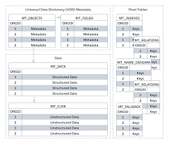

# STEP 1.3 – System Architecture Design
## Multi-Tenant SaaS Project & Task Management System

---

## 1. System Architecture Overview

The system follows a standard three-tier architecture consisting of a frontend, backend API, and database. The application is designed as a multi-tenant SaaS platform where multiple organizations share the same infrastructure while maintaining strict data isolation.

---

## 2. High-Level Architecture

The architecture consists of the following components:

### Client (Browser)
- Users access the system through a web browser
- Requests are sent to the frontend application
- JWT tokens are stored on the client for authentication

### Frontend Application (React)
- Built using React.js
- Handles user interface and user interactions
- Communicates with backend APIs using HTTP/HTTPS
- Implements role-based UI rendering
- Uses protected routes for authenticated pages

### Backend API Server (Node.js + Express)
- Exposes RESTful APIs
- Handles authentication and authorization
- Implements business logic
- Enforces tenant isolation using tenant_id
- Validates input and handles errors
- Logs important actions in audit_logs table

### Database (PostgreSQL)
- Stores all persistent data
- Uses a shared database and shared schema
- Enforces relationships using foreign keys
- Maintains data isolation using tenant_id

---

## 3. System Architecture Diagram

The following diagram represents the high-level system architecture of the application:

---

## 4. Authentication & Authorization Flow

1. User submits login credentials along with tenant subdomain
2. Backend verifies credentials and tenant status
3. Backend generates a JWT token containing:
   - userId
   - tenantId
   - role
4. JWT token is sent to the frontend
5. Frontend includes JWT token in Authorization header for all protected API requests
6. Backend middleware validates token and enforces role-based access control

---

## 5. Database Schema Design

The database is designed using a shared database and shared schema approach. Each tenant’s data is isolated using the tenant_id column.

### Core Tables
- tenants
- users
- projects
- tasks
- audit_logs

Each table (except super_admin users) contains a tenant_id column to enforce data isolation.

---

## 6. Entity Relationship Diagram (ERD)

The following diagram illustrates the database schema and relationships:

---

## 7. API Architecture

The backend exposes RESTful APIs organized by modules.

### Authentication APIs
- POST /api/auth/register-tenant
- POST /api/auth/login
- GET /api/auth/me
- POST /api/auth/logout

### Tenant Management APIs
- GET /api/tenants/:tenantId
- PUT /api/tenants/:tenantId
- GET /api/tenants (super_admin only)

### User Management APIs
- POST /api/tenants/:tenantId/users
- GET /api/tenants/:tenantId/users
- PUT /api/users/:userId
- DELETE /api/users/:userId

### Project Management APIs
- POST /api/projects
- GET /api/projects
- PUT /api/projects/:projectId
- DELETE /api/projects/:projectId

### Task Management APIs
- POST /api/projects/:projectId/tasks
- GET /api/projects/:projectId/tasks
- PATCH /api/tasks/:taskId/status
- PUT /api/tasks/:taskId

---

## 8. Tenant Isolation Strategy

- tenant_id is extracted from JWT token
- Client-provided tenant identifiers are never trusted
- All database queries are filtered using tenant_id
- Super admin users have tenant_id = NULL and bypass tenant filtering

---

## Conclusion

This architecture ensures scalability, security, and strict tenant data isolation. The system design follows industry best practices and provides a strong foundation for building a production-ready multi-tenant SaaS application.
